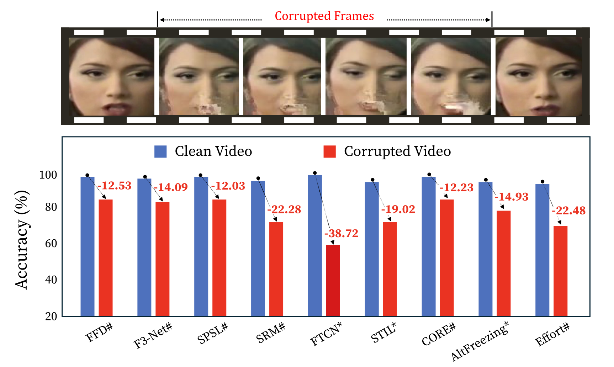

# ICR-Net: Robust Deepfake Detection under Temporal Corruption

**Are Deepfake Detectors Robust to Temporal Corruption?**

Chan Park, Hyeongjun Choi, Muhammad Shahid Muneer, Binh Minh Le, Simon S. Woo\*  
`{pchan1018, junhjun, shahidmuneer, bmle, swoo}@g.skku.edu`

<p align="center">
  <a href="paper.pdf"></a>
  <a href="https://github.com/Ckck12/ICR-Net"></a>
  
  
  
  
</p>

## Overview

ICR-Net is a robust deepfake detection framework for **temporal corruptions** that arise during real-world video streaming — packet loss, bit errors, black frames, motion blur, and aggressive H.264/H.265 compression.

We introduce **DF-TCB** (DeepFake Temporal Corruption Benchmark) on FaceForensics++ and DFDC, and propose **ICR-Net**, which:

1. estimates per-frame reliability with a GRU-based integrity module,
2. selectively corrects corrupted frame embeddings with a 1D-CNN residual branch, and
3. aligns clean–corrupted representations through contrastive learning.

This yields corruption-invariant, class-separable features and strong cross-dataset generalization under temporal disruptions.

## Motivation: Temporal Corruption in Streaming

<p align="center">
  
</p>
<p align="center"><em>Figure 1. Deepfake videos with temporal corruptions in the real-world scenario. Unstable web streaming can degrade frames and cause existing detectors to fail.</em></p>

## DF-TCB Benchmark

<p align="center">
  
</p>
<p align="center"><em>Figure 2. Overview of DF-TCB. Built on FF++ real/fake videos, we apply eight temporal corruption types with consecutive or distributed corrupted frames across multiple severities.</em></p>

**Supported corruptions:** `black_frame`, `motion_blur`, `packet_loss`, `bit_error`, `h264_crf`, `h264_abr`, `h265_crf`, `h265_abr`

## Robustness of Existing Detectors

<p align="center">
  
</p>
<p align="center"><em>Figure 3. Robustness of existing detectors against temporal corruptions. Both frame- and video-based models achieve high accuracy on clean videos, but their performance drops sharply under temporal corruptions in both intra-dataset (FF++ / FF++-C) and cross-dataset (DFDC / DFDC-C) settings.</em></p>

## ICR-Net Framework

<p align="center">
  
</p>
<p align="center"><em>Figure 4. Overview of ICR-Net. Step 1 encodes clean/corrupted pairs; Step 2 assesses integrity and applies selective correction; Step 3 aligns representations contrastively; Step 4 performs classification.</em></p>

## Experimental Results

Under the same corruption-aware training protocol, **ICR-Net** consistently outperforms frame-based and video-based baselines on temporal corruptions. Values are video-level accuracy (%). **Bold** = best; <u>underline</u> = second best.

<p><strong>Table 1.</strong> Intra-dataset temporal corruption robustness on FF++ / FF++-C.</p>

<table>
  <thead>
    <tr>
      <th>Model</th>
      <th>Clean</th>
      <th>Black Frame</th>
      <th>Motion Blur</th>
      <th>Packet Loss</th>
      <th>Bit Error</th>
      <th>H.264 CRF</th>
      <th>H.264 ABR</th>
      <th>H.265 CRF</th>
      <th>H.265 ABR</th>
    </tr>
  </thead>
  <tbody>
    <tr><td colspan="10"><strong>Frame-based</strong></td></tr>
    <tr><td>FFD</td><td>98.14</td><td>85.89</td><td>91.23</td><td><u>90.98</u></td><td>90.83</td><td><u>91.80</u></td><td>88.70</td><td>91.44</td><td>90.63</td></tr>
    <tr><td>F3-Net</td><td>98.10</td><td>85.84</td><td>88.16</td><td>90.22</td><td>90.47</td><td>90.47</td><td>88.33</td><td>89.21</td><td><u>92.05</u></td></tr>
    <tr><td>SPSL</td><td><strong>98.29</strong></td><td>84.76</td><td>91.24</td><td>86.94</td><td>91.84</td><td>85.64</td><td>85.31</td><td>91.89</td><td>91.81</td></tr>
    <tr><td>SRM</td><td>97.87</td><td>86.11</td><td>88.27</td><td>90.85</td><td><u>92.09</u></td><td>91.45</td><td>91.17</td><td>90.04</td><td>90.21</td></tr>
    <tr><td>CORE</td><td><u>98.27</u></td><td>85.23</td><td>85.14</td><td>90.18</td><td>91.43</td><td>86.22</td><td>87.93</td><td>89.10</td><td>90.66</td></tr>
    <tr><td>Effort</td><td>94.40</td><td>84.36</td><td>85.52</td><td>86.75</td><td>87.26</td><td>85.80</td><td>85.61</td><td>85.52</td><td>86.67</td></tr>
    <tr><td colspan="10"><strong>Video-based</strong></td></tr>
    <tr><td>FTCN</td><td>87.62</td><td>86.37</td><td>82.64</td><td>82.97</td><td>82.65</td><td>83.48</td><td>83.69</td><td>83.69</td><td>83.54</td></tr>
    <tr><td>STIL</td><td>97.35</td><td>86.00</td><td><u>91.31</u></td><td>86.83</td><td>89.58</td><td>88.35</td><td>89.15</td><td>92.16</td><td>89.28</td></tr>
    <tr><td>AltFreezing</td><td>97.21</td><td><u>91.54</u></td><td>90.71</td><td>85.73</td><td>90.77</td><td>89.40</td><td><strong>94.58</strong></td><td>92.55</td><td>90.47</td></tr>
    <tr><td><strong>ICR-Net (ours)</strong></td><td>97.86</td><td><strong>94.92</strong></td><td><strong>94.88</strong></td><td><strong>96.03</strong></td><td><strong>96.67</strong></td><td><strong>96.55</strong></td><td><u>92.93</u></td><td><strong>97.50</strong></td><td><strong>95.83</strong></td></tr>
  </tbody>
</table>

<p><strong>Table 2.</strong> Cross-dataset temporal corruption robustness on DFDC / DFDC-C.</p>

<table>
  <thead>
    <tr>
      <th>Model</th>
      <th>Clean</th>
      <th>Black Frame</th>
      <th>Motion Blur</th>
      <th>Packet Loss</th>
      <th>Bit Error</th>
      <th>H.264 CRF</th>
      <th>H.264 ABR</th>
      <th>H.265 CRF</th>
      <th>H.265 ABR</th>
    </tr>
  </thead>
  <tbody>
    <tr><td colspan="10"><strong>Frame-based</strong></td></tr>
    <tr><td>FFD</td><td>61.41</td><td>50.32</td><td>50.12</td><td>50.49</td><td>50.22</td><td>50.38</td><td>50.19</td><td>51.02</td><td>49.73</td></tr>
    <tr><td>F3-Net</td><td>72.02</td><td>49.93</td><td>49.77</td><td>50.01</td><td>49.92</td><td>50.13</td><td>49.68</td><td>49.33</td><td>49.59</td></tr>
    <tr><td>SPSL</td><td>72.15</td><td>50.41</td><td>50.18</td><td>50.25</td><td>49.97</td><td>50.03</td><td>49.83</td><td>50.31</td><td>50.28</td></tr>
    <tr><td>SRM</td><td>69.91</td><td>50.11</td><td>50.34</td><td>49.95</td><td>50.21</td><td>49.87</td><td>49.72</td><td>49.54</td><td>49.61</td></tr>
    <tr><td>CORE</td><td>71.28</td><td>50.23</td><td>49.91</td><td>50.17</td><td>50.33</td><td>49.88</td><td>49.52</td><td>49.78</td><td>49.44</td></tr>
    <tr><td>Effort</td><td><strong>79.85</strong></td><td>55.13</td><td>54.88</td><td>54.02</td><td>54.71</td><td>54.96</td><td>53.87</td><td>55.43</td><td>53.69</td></tr>
    <tr><td colspan="10"><strong>Video-based</strong></td></tr>
    <tr><td>FTCN</td><td>61.21</td><td>53.11</td><td>52.89</td><td>53.39</td><td>54.12</td><td>53.02</td><td>52.07</td><td>53.34</td><td>53.55</td></tr>
    <tr><td>STIL</td><td>67.71</td><td>49.15</td><td>49.98</td><td>48.50</td><td>50.05</td><td>48.61</td><td>48.01</td><td>50.24</td><td>49.82</td></tr>
    <tr><td>AltFreezing</td><td>72.95</td><td>51.82</td><td>50.73</td><td>51.23</td><td>50.15</td><td>51.35</td><td>49.22</td><td><u>57.11</u></td><td>51.47</td></tr>
    <tr><td><strong>ICR-Net (ours)</strong></td><td><u>78.56</u></td><td><strong>58.14</strong></td><td><strong>59.23</strong></td><td><strong>59.51</strong></td><td><strong>58.98</strong></td><td><strong>59.12</strong></td><td><strong>57.98</strong></td><td><strong>59.88</strong></td><td><strong>58.33</strong></td></tr>
  </tbody>
</table>

### Key Features

- **Temporal Integrity Assessment** — GRU-based frame reliability estimation
- **Selective Frame Correction** — integrity-gated residual restoration
- **Contrastive Learning** — corruption-invariant features from clean/corrupted pairs
- **Robust Classification** — frame-level logits with temporal consistency
- **Cross-dataset Generalization** — strong performance on FF++-C and DFDC-C

## Quick Start

### Environment Setup

```bash
git clone https://github.com/Ckck12/ICR-Net.git
cd ICR-Net

conda create -n icr-net python=3.9
conda activate icr-net
pip install -r requirements.txt
```

### Make Corrupted Dataset

Use the provided scripts:

- `make_corruption_original.py`
- `make_packet_loss_corruption.py`

### Data Preparation

1. **Clean data:** FaceForensics++ clean videos
2. **Corrupt data:** videos with temporal corruptions applied
   - Supported corruptions: `bit_error`, `h264_crf`, `h264_abr`, `h265_crf`, `h265_abr`, `motion_blur`, `packet_loss`

### Training

```bash
python scripts/train.py \
    --config src/configs/icr_net.yaml \
    --train_corruption packet_loss \
    --train_severity 3 \
    --output_dir ./checkpoints

# Distributed training
bash scripts/train_distributed.sh
```

### Inference

```bash
python scripts/test.py \
    --config src/configs/icr_net.yaml \
    --weights ./checkpoints/best_model.pth \
    --input_video ./test_video.mp4

python scripts/test_batch.py \
    --config src/configs/icr_net.yaml \
    --weights ./checkpoints/best_model.pth \
    --test_corruption packet_loss \
    --test_severity 3
```

## Project Structure

```
ICR-Net/
├── assets/                     # Paper figures for README
├── src/
│   ├── models/icr_net.py
│   ├── datasets/pair_dataset.py
│   ├── utils/metrics.py
│   └── configs/icr_net.yaml
├── scripts/
│   ├── train.py
│   ├── test.py
│   ├── train_distributed.sh
│   └── test_batch.py
├── examples/
├── make_corruption_original.py
├── make_packet_loss_corruption.py
├── paper.pdf
└── README.md
```

## Citation

If you find this work useful, please cite:

```bibtex
@inproceedings{park2026icrnet,
  title     = {{ICR-Net}: Robust Deepfake Detection under Temporal Corruption},
  author    = {Park, Chan and Choi, Hyeongjun and Muneer, Muhammad Shahid and Le, Binh Minh and Woo, Simon S.},
  booktitle = {Pacific-Asia Conference on Knowledge Discovery and Data Mining (PAKDD)},
  year      = {2026}
}
```

## License

This project is licensed under the MIT License. See [LICENSE](LICENSE) for details.

---

**ICR-Net** — Robust Deepfake Detection through Integrity-aware Contrastive Learning
