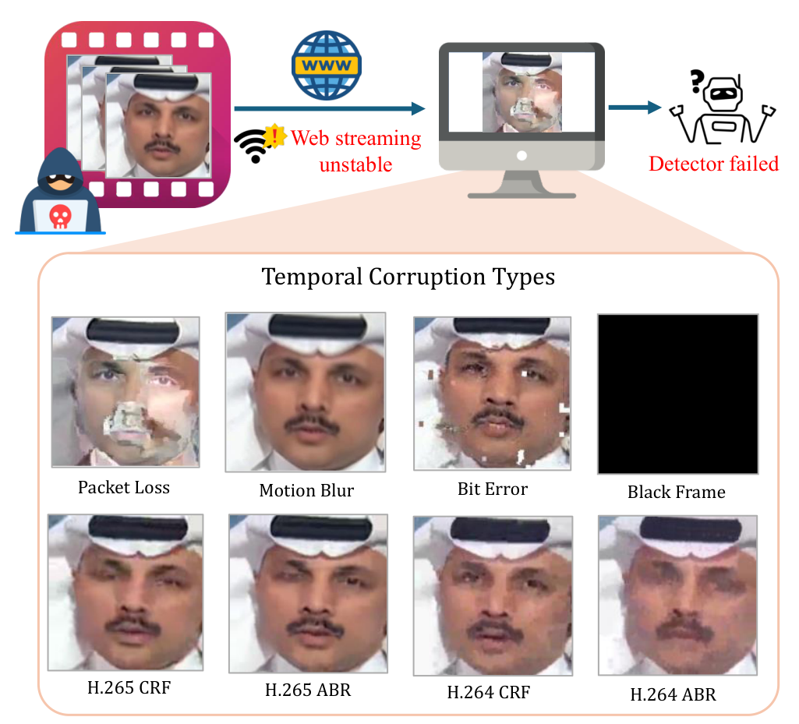
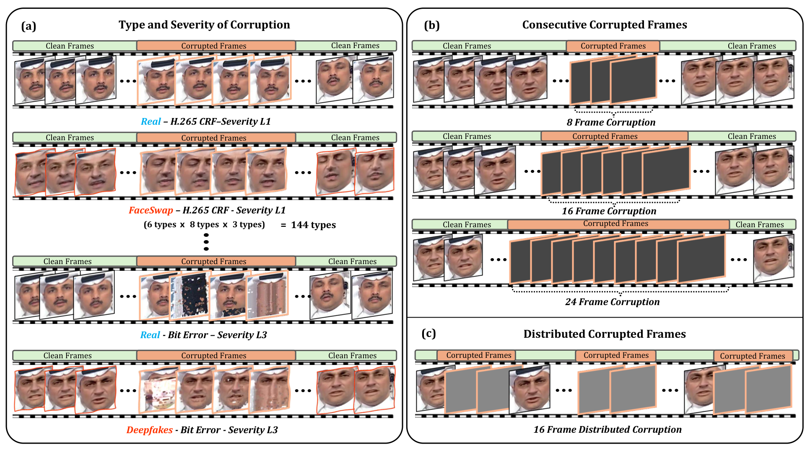
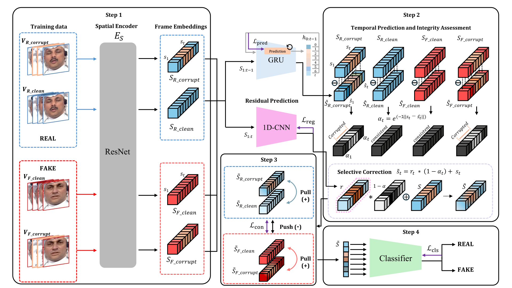

# ICR-Net: Robust Deepfake Detection under Temporal Corruption

**Are Deepfake Detectors Robust to Temporal Corruption?**

Chan Park, Hyeongjun Choi, Muhammad Shahid Muneer, Binh Minh Le, Simon S. Woo\*  
College of Computing and Informatics, Sungkyunkwan University, Suwon, South Korea  
`{pchan1018, junhjun, shahidmuneer, bmle, swoo}@g.skku.edu`

<p align="center">
  <a href="paper.pdf"></a>
  <a href="https://github.com/Ckck12/ICR-Net"></a>
  
  
  
  
</p>

## Overview

ICR-Net is a robust deepfake detection framework for **temporal corruptions** that arise during real-world video streaming — packet loss, bit errors, black frames, motion blur, and aggressive H.264/H.265 compression.

We introduce **DF-TCB** (DeepFake Temporal Corruption Benchmark) on FaceForensics++ and DFDC, and propose **ICR-Net**, which:

1. estimates per-frame reliability with a GRU-based integrity module,
2. selectively corrects corrupted frame embeddings with a 1D-CNN residual branch, and
3. aligns clean–corrupted representations through contrastive learning.

This yields corruption-invariant, class-separable features and strong cross-dataset generalization under temporal disruptions.

## Motivation: Temporal Corruption in Streaming

<p align="center">
  
</p>
<p align="center"><em>Figure 1. Deepfake videos with temporal corruptions in the real-world scenario. Unstable web streaming can degrade frames and cause existing detectors to fail.</em></p>

## DF-TCB Benchmark

<p align="center">
  
</p>
<p align="center"><em>Figure 2. Overview of DF-TCB. Built on FF++ real/fake videos, we apply eight temporal corruption types with consecutive or distributed corrupted frames across multiple severities.</em></p>

**Supported corruptions:** `black_frame`, `motion_blur`, `packet_loss`, `bit_error`, `h264_crf`, `h264_abr`, `h265_crf`, `h265_abr`

## ICR-Net Framework

<p align="center">
  
</p>
<p align="center"><em>Figure 4. Overview of ICR-Net. Step 1 encodes clean/corrupted pairs; Step 2 assesses integrity and applies selective correction; Step 3 aligns representations contrastively; Step 4 performs classification.</em></p>

### Key Features

- **Temporal Integrity Assessment** — GRU-based frame reliability estimation
- **Selective Frame Correction** — integrity-gated residual restoration
- **Contrastive Learning** — corruption-invariant features from clean/corrupted pairs
- **Robust Classification** — frame-level logits with temporal consistency
- **Cross-dataset Generalization** — strong performance on FF++-C and DFDC-C

## Quick Start

### Environment Setup

```bash
git clone https://github.com/Ckck12/ICR-Net.git
cd ICR-Net

conda create -n icr-net python=3.9
conda activate icr-net
pip install -r requirements.txt
```

### Make Corrupted Dataset

Use the provided scripts:

- `make_corruption_original.py`
- `make_packet_loss_corruption.py`

### Data Preparation

1. **Clean data:** FaceForensics++ clean videos
2. **Corrupt data:** videos with temporal corruptions applied
   - Supported corruptions: `bit_error`, `h264_crf`, `h264_abr`, `h265_crf`, `h265_abr`, `motion_blur`, `packet_loss`

### Training

```bash
python scripts/train.py \
    --config src/configs/icr_net.yaml \
    --train_corruption packet_loss \
    --train_severity 3 \
    --output_dir ./checkpoints

# Distributed training
bash scripts/train_distributed.sh
```

### Inference

```bash
python scripts/test.py \
    --config src/configs/icr_net.yaml \
    --weights ./checkpoints/best_model.pth \
    --input_video ./test_video.mp4

python scripts/test_batch.py \
    --config src/configs/icr_net.yaml \
    --weights ./checkpoints/best_model.pth \
    --test_corruption packet_loss \
    --test_severity 3
```

## Project Structure

```
ICR-Net/
├── assets/                     # Paper figures for README
├── src/
│   ├── models/icr_net.py
│   ├── datasets/pair_dataset.py
│   ├── utils/metrics.py
│   └── configs/icr_net.yaml
├── scripts/
│   ├── train.py
│   ├── test.py
│   ├── train_distributed.sh
│   └── test_batch.py
├── examples/
├── make_corruption_original.py
├── make_packet_loss_corruption.py
├── paper.pdf
└── README.md
```

## Citation

If you find this work useful, please cite:

```bibtex
@inproceedings{park2026icrnet,
  title     = {{ICR-Net}: Robust Deepfake Detection under Temporal Corruption},
  author    = {Park, Chan and Choi, Hyeongjun and Muneer, Muhammad Shahid and Le, Binh Minh and Woo, Simon S.},
  booktitle = {Pacific-Asia Conference on Knowledge Discovery and Data Mining (PAKDD)},
  year      = {2026}
}
```

## License

This project is licensed under the MIT License. See [LICENSE](LICENSE) for details.

---

**ICR-Net** — Robust Deepfake Detection through Integrity-aware Contrastive Learning
