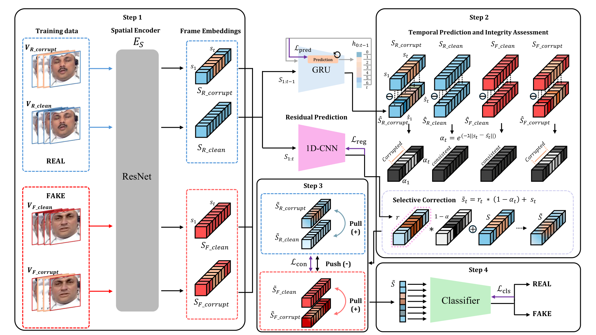

<h1 align="center">ICR-Net: Robust Deepfake Detection under Temporal Corruption</h1>

<p align="center">
  Chan Park, Hyeongjun Choi, Muhammad Shahid Muneer, Binh Minh Le, Simon S. Woo<sup>*</sup>
  <br>
  College of Computing and Informatics, Sungkyunkwan University (DASH Lab)
  <br>
  <sup>*</sup> Corresponding author
</p>

<p align="center">
  <a href="https://pakdd2026.org/">PAKDD 2026</a> · The 30th Pacific-Asia Conference on Knowledge Discovery and Data Mining
</p>

<p align="center">
  <a href="https://ckck12.github.io/ICR-Net/"></a>
  <a href="paper.pdf"></a>
  <a href="https://doi.org/10.1007/978-981-92-1465-5_24"></a>
  <a href="https://github.com/Ckck12/ICR-Net"></a>
</p>

<p align="center">
  
</p>

## View the project page

**[Open the project page](https://ckck12.github.io/ICR-Net/)**: the DF-TCB benchmark, the ICR-Net method, and the full result tables from the paper (Tables 1–3).

ICR-Net is a deepfake detector for **temporal corruptions** that arise in real-world video streaming (packet loss, bit errors, black frames, motion blur, and aggressive H.264/H.265 compression). We introduce **DF-TCB** (DeepFake Temporal Corruption Benchmark) on FaceForensics++ and DFDC, and propose **ICR-Net**, which

1. estimates per-frame reliability with a GRU-based integrity module,
2. selectively corrects corrupted frame embeddings with a 1D-CNN residual branch, and
3. aligns clean and corrupted representations through contrastive learning.

## Contents

- TL;DR and abstract
- Motivation: temporal corruption in streaming (Fig. 1)
- DF-TCB benchmark: corruption types and severity levels (Fig. 2), robustness of existing detectors (Fig. 3)
- ICR-Net framework (Fig. 4)
- Intra-dataset (FF++ / FF++-C) and cross-dataset (DFDC / DFDC-C) results (Tables 1–2)
- Ablation of training objectives (Table 3)
- BibTeX

## Results at a glance

ICR-Net, video-level accuracy (ACC, %), from Tables 1 and 2 of the paper. **Bold** = best, <ins>underline</ins> = second best among all compared detectors (see the project page for the full tables).

| Setting | Clean | Black Frame | Motion Blur | Packet Loss | Bit Error | H.264 CRF | H.264 ABR | H.265 CRF | H.265 ABR |
|---|---:|---:|---:|---:|---:|---:|---:|---:|---:|
| Intra-dataset: FF++ / FF++-C (Table 1) | 97.86 | **94.92** | **94.88** | **96.03** | **96.67** | **96.55** | <ins>92.93</ins> | **97.50** | **95.83** |
| Cross-dataset: DFDC / DFDC-C (Table 2) | <ins>78.56</ins> | **58.14** | **59.23** | **59.51** | **58.98** | **59.12** | **57.98** | **59.88** | **58.33** |

## Code / Usage

### Environment Setup

```bash
git clone https://github.com/Ckck12/ICR-Net.git
cd ICR-Net

conda create -n icr-net python=3.9
conda activate icr-net
pip install -r requirements.txt
```

### Make Corrupted Dataset

Use the provided scripts:

- `make_corruption_original.py`
- `make_packet_loss_corruption.py`

### Data Preparation

1. **Clean data:** FaceForensics++ clean videos
2. **Corrupt data:** videos with temporal corruptions applied
   - Supported corruptions: `bit_error`, `h264_crf`, `h264_abr`, `h265_crf`, `h265_abr`, `motion_blur`, `packet_loss`

### Training

```bash
python scripts/train.py \
    --config src/configs/icr_net.yaml \
    --train_corruption packet_loss \
    --train_severity 3 \
    --output_dir ./checkpoints

# Distributed training
bash scripts/train_distributed.sh
```

### Inference

```bash
python scripts/test.py \
    --config src/configs/icr_net.yaml \
    --weights ./checkpoints/best_model.pth \
    --input_video ./test_video.mp4

python scripts/test_batch.py \
    --config src/configs/icr_net.yaml \
    --weights ./checkpoints/best_model.pth \
    --test_corruption packet_loss \
    --test_severity 3
```

### Project Structure

```
ICR-Net/
├── index.html, 404.html, .nojekyll   # Project page (GitHub Pages)
├── assets/                           # Paper figures
├── src/
│   ├── models/icr_net.py
│   ├── utils/metrics.py
│   └── configs/icr_net.yaml
├── scripts/
│   ├── train.py
│   ├── train_distributed.sh
│   ├── test.py
│   └── test_batch.py
├── examples/
│   ├── train_example.py
│   └── inference_example.py
├── make_corruption_original.py
├── make_packet_loss_corruption.py
├── requirements.txt
├── setup.py
├── paper.pdf
└── README.md
```

## Citation

If you find this work useful, please cite:

```bibtex
@inproceedings{park2026icrnet,
  title     = {{ICR-Net}: Robust Deepfake Detection under Temporal Corruption},
  author    = {Park, Chan and Choi, Hyeongjun and Muneer, Muhammad Shahid
               and Le, Binh Minh and Woo, Simon S.},
  booktitle = {Proceedings of the 30th Pacific-Asia Conference on Knowledge
               Discovery and Data Mining (PAKDD 2026)},
  year      = {2026},
  doi       = {10.1007/978-981-92-1465-5_24}
}
```

## License

This project is licensed under the MIT License. See [LICENSE](LICENSE) for details.
